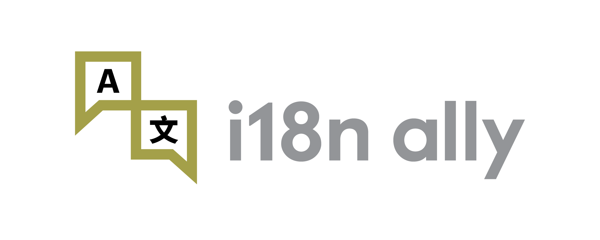

## Supported base Languages
- English (default)
- Portuguese (pt-PT)

## Setup
The Starter Kit uses React-i18next to support internationalization.
The included packages are the following:
```bash
  yarn add i18next
  yarn add i18next-browser-languagedetector
  yarn add react-i18next
```

## Configuration
The configuration is defined in `src/i18n.ts`.

You should start by defining the supported languages for your app
in the `resources` object:
```ts
import enTranslation from '@assets/i18n/en.json';
import ptTranslation from '@assets/i18n/pt.json';

const resources = {
  en: {
    translation: enTranslation,
  },
  pt: {
    translation: ptTranslation,
  },
};
```
This takes advantage of JSON module imports to load the translations from the `@assets/i18n` folder.

The initialization of the `i18n` object is done with some defaults, including the fallback language and support for some basic HTML nodes.
It also loads the `LanguageDetector` and `initReactI18next` plugins.

```ts
i18n
  .use(LanguageDetector)
  .use(initReactI18next) // passes i18n down to react-i18next
  .init({
    resources,
    //debug: false,
    fallbackLng: 'pt',
    react: {
      transSupportBasicHtmlNodes: true,
      transKeepBasicHtmlNodesFor: ['br', 'strong', 'b', 'p'],
    },
    interpolation: {
      escapeValue: false, // react already safes from xss => https://www.i18next.com/translation-function/interpolation#unescape
    },
  });
```

### Translation files
The translation files are JSON files located in the `/src/assets/i18n` folder with the same name as the language code.
You only require one file per language.

You can organize the file structure as you prefer but as an example we will use the following:

```json
{
  "welcome": {
    "skipButton": "Skip",
    "checkSkipIntroLabel": "Do not show again",
    "continueButton": "CONTINUE"
  }
}
```

### Using the translations

After adding the translations we can use the i18n keys like this:

```tsx
import { t } from 'i18next';
import { Trans } from 'react-i18next';

// In TSX
<IonTitle>{t('welcome.title')}</IonTitle>

// Inline
const title = t('welcome.title');

// As a component
<Trans i18nKey="welcome.title"></Trans>
```

### Editing the translations

To improve developer experience we strongly suggest using the [i18n Ally](https://marketplace.visualstudio.com/items?itemName=Lokalise.i18n-ally) VS Code extension.
It allows you to edit the translations directly in VS Code, extract keys from hardcoded strings and so on.

